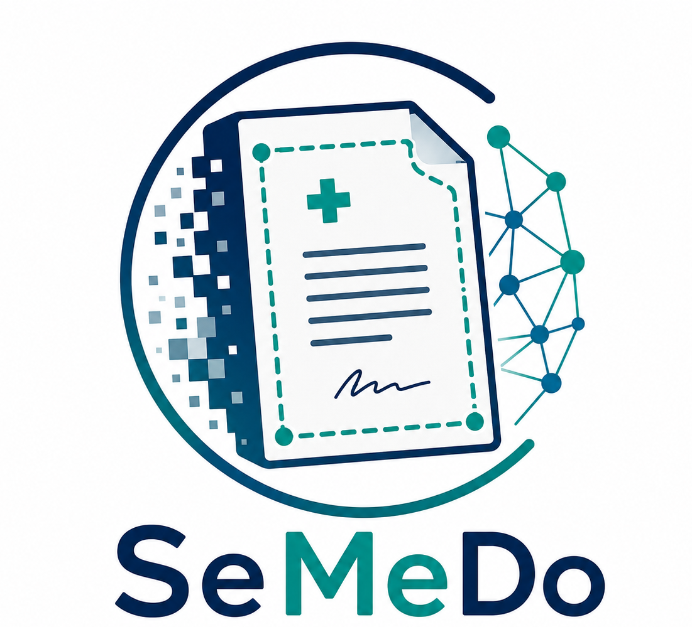

#  SeMeDo

SeMeDo provides deep-learning-based segmentation of patient-generated medical document photographs, separating the document region from background clutter, shadows, and perspective distortion in smartphone-captured images. It combines a lightweight annotation tool for creating custom ground-truth masks with a ready-to-use fine-tuning pipeline, so you can adapt the included U²-Net model to your own institution's documents with as few as ~100 annotated images. Use it as a preprocessing step before OCR or document understanding pipelines, whenever your input images come from uncontrolled, real-world photo capture rather than clean scans.

## Getting started

SeMeDo supports Python 3.10. The easiest local setup uses Conda; Docker is
available as an isolated alternative. Run all commands from the repository
root.

### Option 1: Conda

Create and activate a dedicated environment, install the dependencies, and
register it as a Jupyter kernel:

```bash
conda create --name semedo python=3.10 -y
conda activate semedo
python -m pip install --upgrade pip
python -m pip install -r requirements.txt
```

### Option 2: Docker

The Docker image uses NVIDIA's PyTorch 23.10 base image and is intended for a
Linux host with an NVIDIA GPU, a recent NVIDIA driver, and the NVIDIA Container
Toolkit. 

Build the Docker container with your project name:
```bash
docker build -t <YOUR PROJECT NAME>:0.1 .
```

Run the Docker container with your project name:
```bash
docker run -p <YOUR LOCAL PORT>:22 --rm --gpus all <YOUR PROJECT NAME>:0.1
```

## Environment

This repository is built on a GPU-optimized Python/PyTorch blueprint. The
Docker image pre-installs:

- Python 3.10
- Anaconda with a default environment
    - pyTorch 2.1 (NGC container `nvcr.io/nvidia/pytorch:23.10-py3`)
    - Linter for appropiate code standards (and config files for reasonable defaults)
        - flake8
        - pyLint
- NVIDIA toolchain
    - CUDA 12.2
    - cuBLAS
    - NVIDIA cuDNN
    - NVIDIA NCCL (optimized for NVLink)
    - RAPIDS
    - NVIDIA Data Loading Library (DALI)
    - TensorRT
    - Torch-TensorRT

Specify the packages you require in the *requirements.txt*. More complex environment customization goes into *Dockerfile*.

While using Visual Studio Code for development is encouraged, the image does not depend on this IDE in any way. As a side effect, its required server components are not even installed by default if the Dockerfile in root is built manually. Opening the project in VS Code will set the proper default and configure everything appropriately. Alternatively, build the container with `docker build -t <YOUR PROJECT NAME>:0.1 .` and run the container with `docker run -p <YOUR LOCAL PORT>:22 --rm --gpus all <YOUR PROJECT NAME>:0.1`.

## Annotation tool

The annotation notebook is config-driven.

1. Edit [src/annotate/annotation_config.json](src/annotate/annotation_config.json)
2. Set the image folders in `image_folders`
3. Set the GT export path in `output_csv`
4. Set `min_points`/`max_points` (default `4`/`50`) to control how many polygon corners an annotation may have — the tool blocks saving below `min_points` and stops accepting new points at `max_points`.
5. Open [src/annotate/annotation.ipynb](src/annotate/annotation.ipynb) and run the first cell

By default the config points at the institutional image folders under [data/uke](data/uke) (`train`/`val`/`test`) and writes the ground-truth CSV to `data/uke/train_uke_model_coordinates.csv` — the same paths `training_config.json` expects for `uke_train_dir`/`uke_val_dir`/`uke_test_dir`/`uke_metadata_path`, so you can annotate and then fine-tune without changing any paths. (`uke` throughout the code/config is just this project's internal shorthand for "institutional data" — swap in your own institution's images/annotations under those same paths and keys.)

## Training pipeline

Training uses [src/finetune/training_config.json](src/finetune/training_config.json). Neither the SmartDoc15 dataset nor the pretrained `u2net.pth` weights are stored in this repository but can be downloaded.

1. Edit [src/finetune/training_config.json](src/finetune/training_config.json):
   - Check `model_path`, `root_folder`, `opensource_metadata_path`, `opensource_image_folder_path` point where you want the dataset/weights to live.
   - Pick a scenario to run by setting `selected_ratio_name` to one of the `ratio_scenarios` entries (or set `run_all_ratio_scenarios: true` to sweep all of them).
   - Weights & Biases experiment tracking is optional and off by default (`wandb_mode: "disabled"`). Set `wandb_mode: "online"` and point `wandb_entity`/`wandb_project` at your own account to enable it.
2. Download the assets referenced by the config:
   ```
   cd src/finetune
   python download_assets.py
   ```
   This fetches `u2net.pth` (from the URL in `u2net_download_url`) and the SmartDoc15 `frames.tar.gz` release asset, and skips anything that's already present. Use `--force` to redownload, or `--skip-model`/`--skip-data` to fetch only one of the two.
3. Start training:
   ```
   python finetuning.py
   ```
   or open [src/finetune/finetuning.ipynb](src/finetune/finetuning.ipynb), run the config/download/validation cells, then set `RUN_TRAINING = True` in the last cell.

If you also have your own annotated (institutional-style) data, point `uke_metadata_path`/`uke_train_dir`/`uke_val_dir`/`uke_test_dir` at it and keep `include_uke_in_training: true`; otherwise set that flag to `false` to train on SmartDoc15 alone.

## Evaluation

`finetuning.py` reserves everything under `uke_test_dir` as a held-out test set that no
patient-group fold ever trains or validates on, and after each fold run it appends a row
(scenario, fold, lr, checkpoint path, best val metrics) to
`checkpoint_dir/training_runs_manifest.csv`.

1. Once training has produced at least one fold checkpoint (and its manifest row), run:
   ```
   cd src/finetune
   python evaluate_ensemble.py
   ```
   This reconstructs the held-out institutional test set from `training_config.json`,
   evaluates the plain pretrained `u2net.pth` as a baseline, then groups the manifest by
   scenario/lr/aug/seed/domain and evaluates the fold checkpoints in each group as an
   ensemble (probability maps averaged across folds, thresholded at 0.5). Results go to
   `checkpoint_dir/test_eval/test_ensemble_per_image.csv` (one row per image per group) and
   `test_ensemble_summary.csv` (means per group).

2. To visualize the per-image results as a violin plot (pretrained vs. each fine-tuned
   scenario):
   ```
   python plot_results.py
   ```
   This reads `test_ensemble_per_image.csv` and writes `violin_selection_score.png`/`.pdf`
   next to it. Pass `--per-image-csv`/`--output-dir` to point at a different location.

## Acknowledgments

This project adapts the U2-Net architecture and pretrained weights from
[xuebinqin/U-2-Net](https://github.com/xuebinqin/U-2-Net) (via the
[LeCongThuong/U2Net](https://github.com/LeCongThuong/U2Net) fork), licensed
under the [Apache License 2.0](https://www.apache.org/licenses/LICENSE-2.0)
(see the header of [src/finetune/u2net.py](src/finetune/u2net.py) for the
adaptation notice; the pretrained weights are downloaded at setup time and
not stored in this repository).

For evaluation, it uses the SmartDoc15-CH1 dataset
([jchazalon/smartdoc15-ch1-dataset](https://github.com/jchazalon/smartdoc15-ch1-dataset),
licensed under [CC BY 4.0](https://creativecommons.org/licenses/by/4.0/),
downloaded at setup time and not stored in this repository):

> J.-C. Burie et al., "ICDAR2015 Competition on Smartphone Document Capture
> and OCR (SmartDoc)", 13th International Conference on Document Analysis and
> Recognition (ICDAR), 2015.

Python dependencies (numpy, opencv-python/opencv-contrib-python, torch/torchvision,
wandb) are installed separately via `pip`/the Docker base image under their
own licenses (BSD-3-Clause, Apache-2.0, BSD-3-Clause, MIT respectively) and
are not redistributed as part of this repository.

## License

This project's own code is licensed under the terms in [LICENSE](LICENSE).
